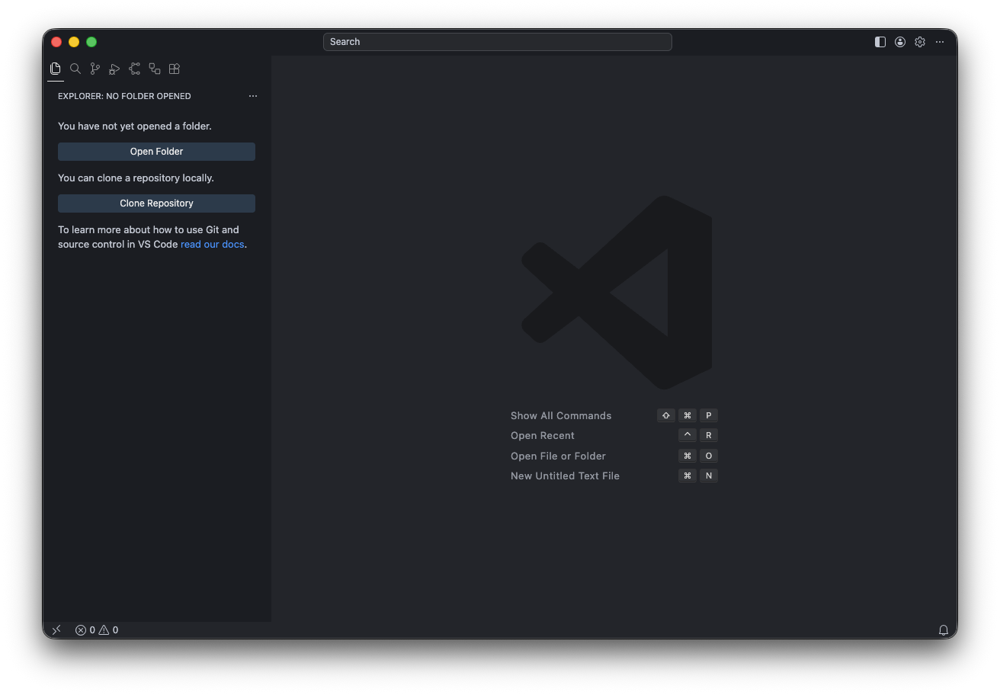
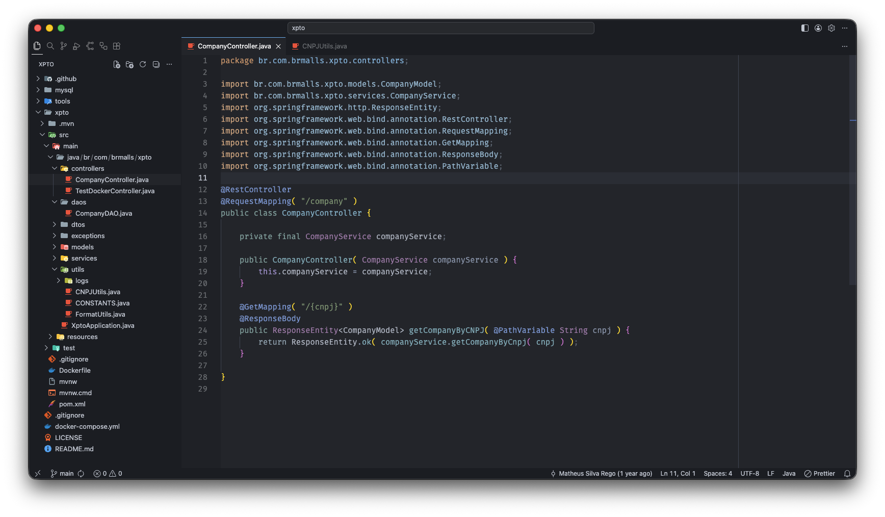
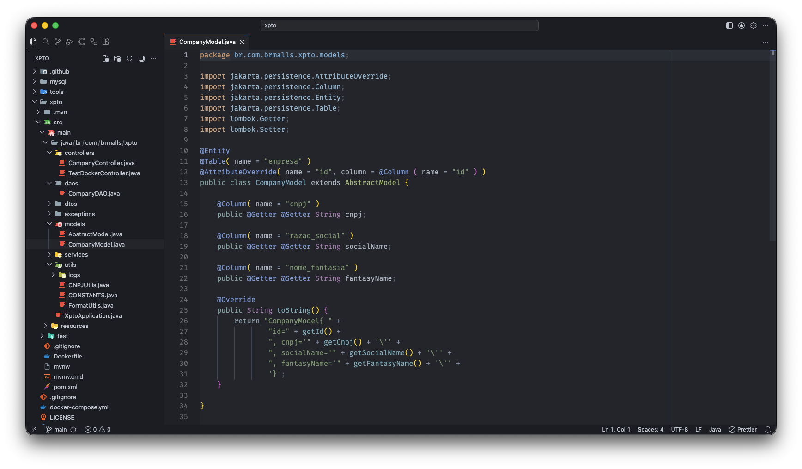
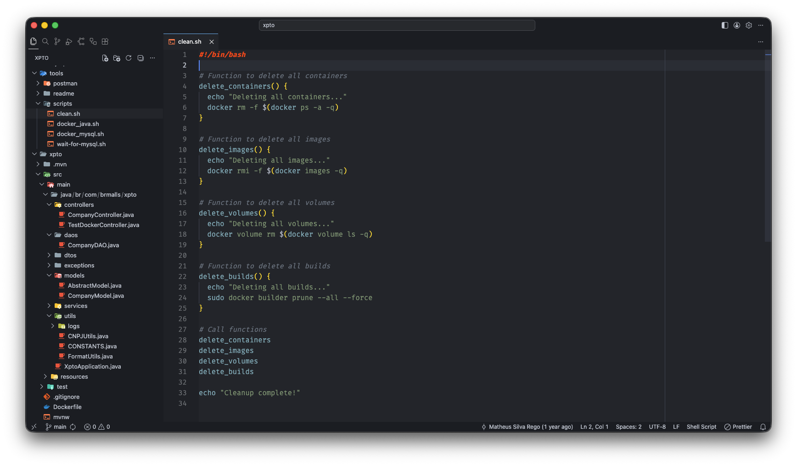

# DeepSky

> A deep, dark theme for Visual Studio Code inspired by the night sky — calm colors, low contrast fatigue, and a carefully tuned palette for long coding sessions.

## Installation

1. Open **Visual Studio Code**
2. Go to **Extensions** (`Ctrl+Shift+X` / `Cmd+Shift+X`)
3. Search for **DeepSky**
4. Click **Install**
5. Open the Command Palette (`Ctrl+Shift+P` / `Cmd+Shift+P`), type **Color Theme**, and select **DeepSky**

Or install directly from the [VS Code Marketplace](https://marketplace.visualstudio.com/items?itemName=arara.deepsky).

## 

Preview

## Color Palette

| Role | Color | Hex |
|---|---|---|
| Background | Editor | `#23252A` |
| Background | Sidebar / Titlebar | `#1B1D22` |
| Foreground | Text | `#ABB2BF` |
| Blue | Info / Functions | `#61AFEF` |
| Green | Strings / Added | `#98C379` |
| Red | Errors / Deleted | `#E06C75` |
| Yellow | Warnings / Numbers | `#D19A66` |
| Purple | Types | `#A47AAC` |
| Cyan | Terminal Cyan | `#56B6C2` |
| Gold | Highlights / Badges | `#D8B042` |

## Supported Languages

DeepSky has been tuned with specific token rules for the following languages:

- **JavaScript** and **TypeScript**
- **Java**
- **Dart** / Flutter
- **Python**
- **HTML** and **CSS**
- **JSON** and **YAML**
- **Markdown**

It works with any language supported by VS Code — the languages above have extra care applied to control flow, types, annotations, and import statements.

## Contributing

Contributions are welcome! If you find a language or token that looks off, feel free to open an issue or submit a pull request.

1. Fork the repository
2. Create a new branch: `git checkout -b fix/language-tokens`
3. Make your changes in `themes/DeepSky-color-theme.json`
4. Open the repo in VS Code and press `F5` to preview your changes
5. Submit a pull request describing what you changed and why

**Repository:** [github.com/matheus-srego/deepsky](https://github.com/matheus-srego/deepsky)

## License

[MIT](LICENSE) © [DeepSky](https://github.com/matheus-srego/deepsky/blob/main/LICENSE.md)
